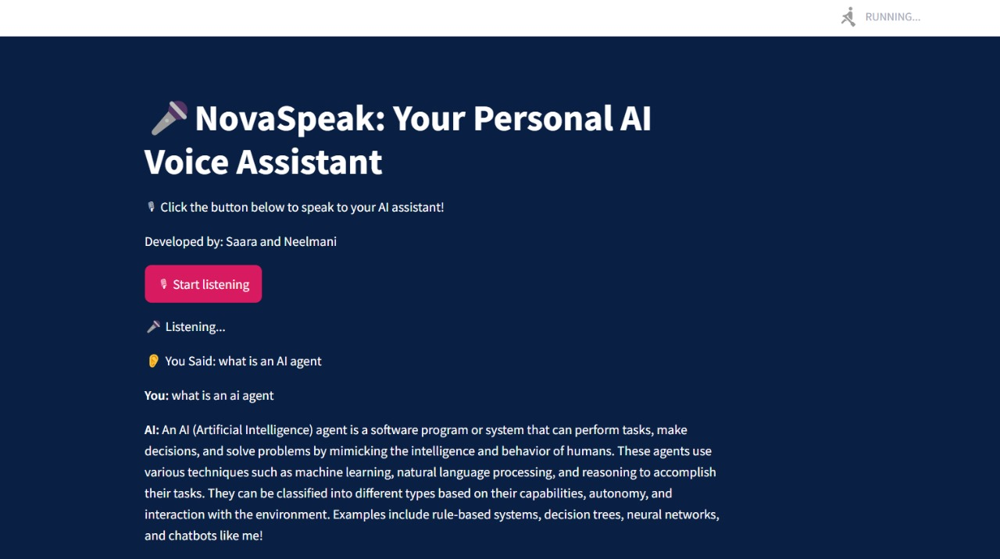

# 🎤 NovaSpeak: Your Personal AI Voice Assistant  

NovaSpeak is an AI-powered voice assistant built using **Streamlit, SpeechRecognition, pyttsx3, and LangChain's Ollama model (Mistral)**. It enables real-time voice interaction with AI, allowing users to speak, receive intelligent responses, and listen to them via text-to-speech.  

## 🚀 Features  
- 🎙 **Voice Recognition**: Speak to NovaSpeak using a microphone.  
- 🤖 **AI-Powered Responses**: Uses **Mistral LLM** for intelligent conversation.  
- 🔊 **Text-to-Speech (TTS)**: AI-generated responses are spoken aloud.  
- 📜 **Chat History**: View previous interactions for context-aware conversations.  
- 🎨 **Custom UI**: Styled with **custom Streamlit CSS** for a visually appealing interface.  

---

## 📸 Live Demo  

  

---

## 🛠 Installation  

### 1️⃣ **Clone the Repository**  
```bash
git clone https://github.com/NeelmaniRam/NovaSpeak.git
cd NovaSpeak
```
### 2️⃣ Create a Virtual Environment (Recommended)
```bash
python -m venv venv
source venv/bin/activate  # On macOS/Linux
venv\Scripts\activate     # On Windows
```
### 3️⃣ Install Dependencies
Ensure all required Python packages are installed. Run:

```bash
pip install -r requirements.txt
```
### 4️⃣ Run the Application
Start the Streamlit app using:

```bash
streamlit run NovaSpeak.py
```


## 🎤 Usage Instructions
- Click the **"🎙 Start Listening"** button.
- Speak your query into the microphone.
- **NovaSpeak** will process your query and generate an AI response.
- The response is displayed on the screen and spoken out loud.
- The **chat history** is updated for context-aware conversations.


  
